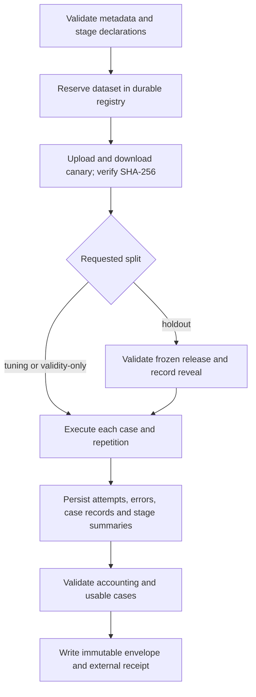

# Shared prompt-evaluation experiments

The infrastructure under [`shared/prompt-eval`](../shared/prompt-eval/README.md)
provides reproducible runs without interpreting stage quality. A stage benchmark
owns its corpora, goldens, executor, validation, scoring, and aggregation.
No existing DMN benchmark or production prompt is changed by this package.

The first consumer is [recommendation evaluation (#34)](https://github.com/samschifman/carewright/issues/34)
([RHAIENG-6456](https://redhat.atlassian.net/browse/RHAIENG-6456)).
[PR #187](https://github.com/samschifman/carewright/pull/187) provides an earlier
DMN benchmark and relevant recommendation-review behavior.
[The later synthesis spike (#31)](https://github.com/samschifman/carewright/issues/31)
([RHAIENG-6453](https://redhat.atlassian.net/browse/RHAIENG-6453)) remains separate.

## Lifecycle



Each run has a fresh UUID and timestamps. The receipt contains the envelope URI,
SHA-256, byte length, run ID, and MLflow run ID. The envelope contains a manifest
of all earlier artifacts, their digests, and a canonical configuration digest.
Never overwrite a receipt: use a new filename per invocation.

Required configuration includes source commit, dataset/evaluator/prompt/production
behavior versions and SHA-256 digests, stage configuration revisions and parameters,
provider/endpoint/model/service tier/inference parameters, case IDs/corpora/source
digests, split membership, and positive repetition count. Credentials are forbidden
in configuration. The stage is responsible for computing these digests from the
actual inputs and for verifying loaded source bytes against the declared digests.
Version labels alone are insufficient.

## Development runs

Follow the package README's installation and example commands. Only
`variant: development` may use `LocalStore`, local Compose MLflow, or file-backed
tracking. There is no automatic persistence fallback. A development run cannot be
promoted by renaming a variant or comparing it with official results.

Local artifacts and the campaign registry live under ignored `working/`. Preserve
the registry across all invocations in a campaign. Official variants are
`baseline`, `ceiling`, `tuned`, and `holdout`; all require verified RHOAI persistence.

## Official RHOAI configuration

Follow the [cluster access guide](../deploy/README.md). The MLflow deployment is
operator-managed in `redhat-ods-applications`, outside the application namespace.
The verified route requires the `/mlflow` prefix. Select the application workspace
explicitly and obtain a current operator credential before running commands:

```bash
export MLFLOW_TRACKING_URI=https://mlflow-redhat-ods-applications.apps.rosa.agentic-mcp.jolf.p3.openshiftapps.com/mlflow
export PROMPT_EVAL_RHOAI_TRACKING_URI="$MLFLOW_TRACKING_URI"
export MLFLOW_ENABLE_WORKSPACES=true
export MLFLOW_WORKSPACE="$(oc project -q)"
export MLFLOW_TRACKING_TOKEN="$(oc whoami -t)"
```

Do not echo or save the token. `PROMPT_EVAL_RHOAI_TRACKING_URI` is the operator's
explicit service allowlist; it is not automatic attestation that an arbitrary
server is RHOAI. Official mode rejects file stores, HTTP, loopback hosts,
credential-bearing URLs, and a tracking URI that differs from the approved URI.
TLS verification remains enabled.

Workspace selection follows [MLflow's documented client configuration](https://mlflow.org/docs/latest/self-hosting/workspaces/configuration/).
For another cluster, use its operator-managed route and workspace rather than
copying this deployment's hostname.

To smoke-test without paid model calls, generate the example configuration and
change only its `variant` to `baseline` and `source_revision` to the checkout's
full commit SHA. Keep the synthetic model and dataset labels; these are transport
results, not official recommendation-quality results.

```bash
prompt-eval run \
  --config working/prompt-eval/baseline.json \
  --adapter prompt_eval.example:adapters \
  --registry working/prompt-eval/campaigns.sqlite \
  --store mlflow --experiment carewright-prompt-eval \
  --receipt working/prompt-eval/baseline-receipt.json
prompt-eval verify --receipt working/prompt-eval/baseline-receipt.json
```

For a real benchmark, replace the configuration and adapter with its stage-owned
implementation. Preflight uploads a random canary, downloads it, and checks its
SHA-256 before the first executor call. Every subsequent artifact is likewise
read back and verified. Authentication, artifact routing, upload, download, or
hash failures produce a nonzero, machine-readable failure with no local fallback.

## Freeze, compare, and reveal

Keep the same dataset, evaluator, stage configuration, production-behavior digest,
case/split manifest, and repetitions across comparable runs. Changing prompts may
change source commits, but it must not silently change production behavior.

```bash
prompt-eval compare \
  --receipt working/prompt-eval/baseline-receipt.json \
  --receipt working/prompt-eval/tuned-receipt.json --varying prompt
```

`--varying prompt` holds model/inference metadata fixed. `--varying model` holds
prompts fixed and allows provider/model/inference changes for model comparisons.
Changing both axes is rejected. Stage metrics remain separated; the comparison
reports repetition mean/min/max/count and the stage-provided aggregate, never a
universal quality score. Failed runs, incomplete repetitions, changed revisions,
different case accounting, and incompatible metric keys are rejected.

After selecting the prompt, freeze an official baseline/tuned pair:

```bash
prompt-eval release \
  --baseline working/prompt-eval/baseline-receipt.json \
  --selected working/prompt-eval/tuned-receipt.json \
  --registry working/prompt-eval/campaigns.sqlite \
  --output working/prompt-eval/holdout-release.json
```

The release pins dataset and split manifest, every stage's evaluator, baseline and
selected prompts, production behavior, model settings, repetition count, and the
source run IDs. It requires complete, compatible official runs and rejects an
active campaign. A release cannot be replaced. Preserve the release file with the
registry; the holdout run also persists it remotely before loading holdout cases.

Create a holdout config from the selected config by setting `variant: holdout` and
`split: holdout`. Keep all frozen fields unchanged:

```bash
prompt-eval run \
  --config working/prompt-eval/holdout.json \
  --adapter your_benchmark.adapter:adapters \
  --registry working/prompt-eval/campaigns.sqlite \
  --store mlflow --experiment carewright-prompt-eval \
  --release working/prompt-eval/holdout-release.json \
  --receipt working/prompt-eval/holdout-receipt.json
```

The registry records the reveal timestamp **before** executing the first holdout
case. A failed execution still consumes the reveal. All declared repetitions and
stages run within that one invocation. A later tuning cycle needs a new dataset
version/content and fresh holdout material. Renaming a revealed dataset, changing
its split manifest, or reusing its holdout content does not reopen it.

## Persistence, retention, and exports

Local writes use exclusive creation. Remote writes belong to a fresh MLflow run
and reject repeated artifact paths; names cannot contain traversal components.
The package never reopens an existing remote run for writing. Failed or interrupted
runs can leave partial immutable artifacts, which must not be treated as a baseline.
Receipts are issued only after the envelope is verified and the MLflow run is
finalized. Full failure artifacts are best-effort when the storage service itself
is unavailable; the caller still receives a typed error.

The platform configuration observed September 29, 2026 stores the tracking database
and served artifacts on a dedicated 10 Gi `gp3-csi` volume whose reclaim policy is
`Delete`. Platform retention and backups remain operator responsibilities. Content
digests detect corruption but cannot recover deleted data. Export important runs:

```bash
prompt-eval export --receipt working/prompt-eval/baseline-receipt.json \
  --output working/prompt-eval/baseline-export
prompt-eval verify --receipt working/prompt-eval/baseline-export/receipt.json \
  --export-dir working/prompt-eval/baseline-export
```

Exports retain original envelope bytes, identities, and digests. Verification of
an export needs no tracking server. Keep external receipts in a trusted location:
the manifest is an integrity mechanism, not a signature against a party capable
of replacing both the artifacts and their receipts.

## Registry and trust boundary

Use **one durable SQLite registry for all runs sharing datasets**, managed by a
single campaign coordinator. SQLite transactions reject concurrent execution on
the same dataset and prevent racing release/reveal transitions. Run IDs are never
reusable. The registry is separate from MLflow, which is not used as a distributed
lock service. Protect and back up the registry with the receipts; do not create a
fresh registry to continue an existing campaign or copy it to parallel workers.
Cross-host coordination and an adversarial operator are outside this interface.

A process crash can leave an active reservation. Investigate the recorded run and
remote artifacts before operator recovery; never automatically clear a lock or a
reveal marker. The registry intentionally fails closed. An interrupted release
export remains recoverable from the registry's stored release JSON.

Adapters and their imports are trusted executable code. They must load only the
case passed to `execute`, avoid model calls in factories, and respect stage-specific
held-out defect policies. Infrastructure gating is not an OS sandbox and cannot
prevent someone manually opening a sealed source file. Dataset ownership includes
protecting the underlying files and access permissions.

## Redaction and observability

Redaction occurs before any local/remote artifact write. It removes complete header
maps, sensitive key values, bearer/basic credentials, URL credentials/query secrets,
common plaintext credential assignments, and known credential environment values.
Credential-bearing raw strings are discarded in full because malformed JSON,
Python reprs, and multiline headers do not provide reliable secret-value boundaries.
Pass additional application-specific secrets to `Redactor(secrets=[...])` in Python.
Unknown credentials embedded without recognizable structure cannot be discovered
reliably; adapters must not embed them in clinical text. This is credential redaction,
not patient-data de-identification. Restricted source/model content remains outside Git.

`security.traced` instruments meaningful functions through `@mlflow.trace` on a
zero-argument, zero-output span. Arguments, return objects, and exception messages
never enter automatic trace serialization. Error spans record only exception type.
Trace destinations are explicitly scoped to the run's experiment, then flushed;
the prior tracking URI is restored afterward. Local-only runs emit no remote traces.
The coordinator owns MLflow's process-global tracking URI while a run is active;
do not run independent tracking sessions concurrently in that process.

Production adapters must disable or sanitize their own automatic LLM tracing and
logging: the infrastructure cannot redact telemetry emitted independently by an
adapter. Use capture hooks for raw request/response transport, and `traced` for
safe spans. Authoritative usage, latency, retry and error evidence is in immutable
artifacts, not dependent on asynchronous trace delivery.

Operational errors distinguish configuration, persistence, invocation, timeout,
parse/contract, empty-result, and internal failures. Per-stage denominators preserve
usable/unusable cases, reported output counts, unaccounted outputs, cases with
unknown accounting, attempts, and failed attempts. Rejected records retain valid
nonnegative counts even when full contract validation fails. A recovered
retry remains visible even when the final case is usable.
